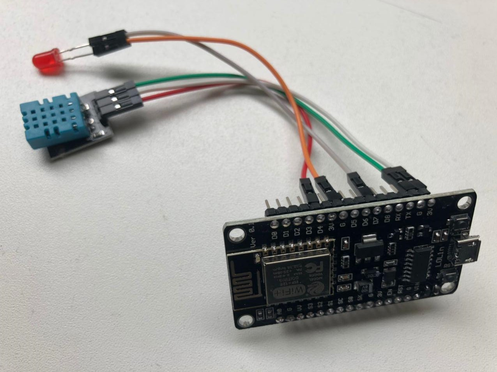

# Microcontroller temperature humidity sensor

An Arduino software to read the temperature and humidity sensor from the ESP8266 board

### Arduino IDE
* Board Manager URL: http://arduino.esp8266.com/stable/package_esp8266com_index.json
* Tools board: NodeMCU 0.9 (ESP-12 Module)

## Wiring setup

